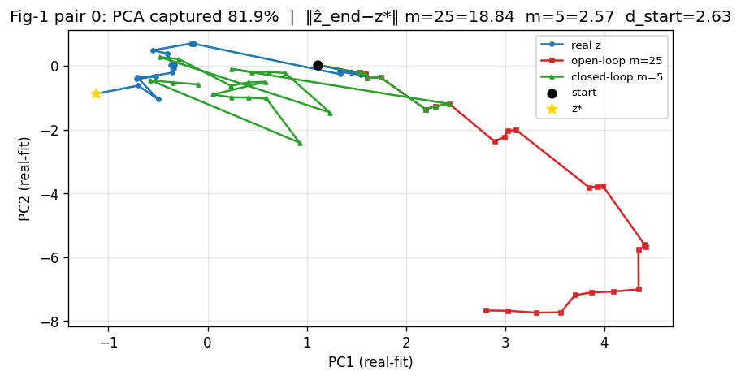
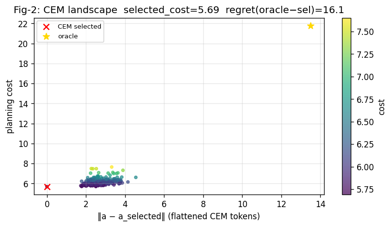
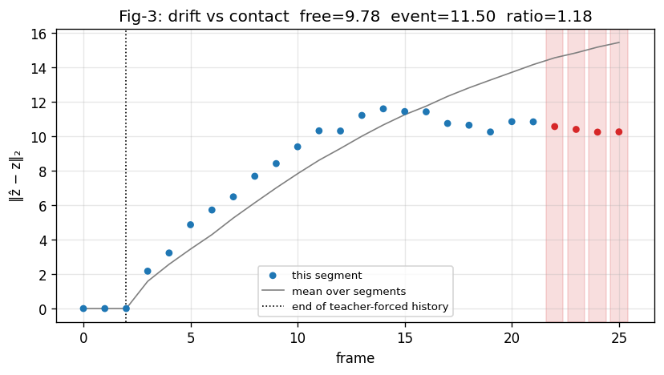
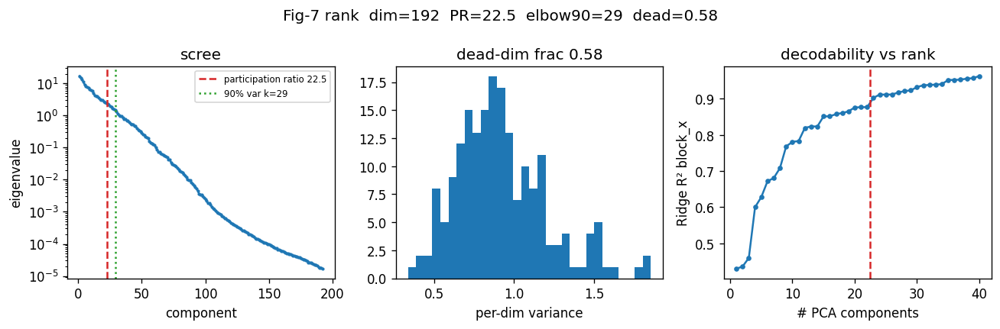
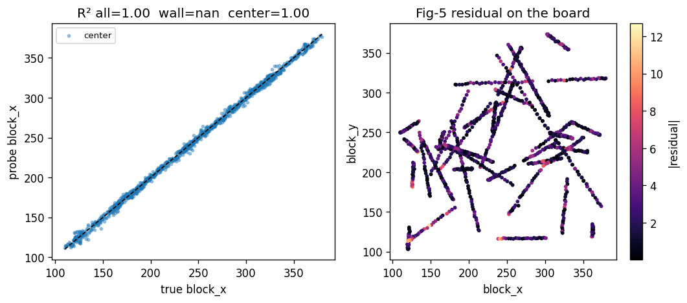
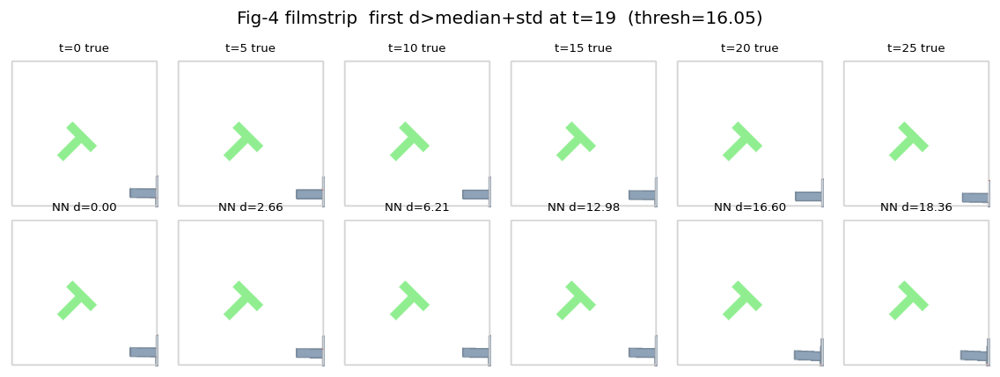
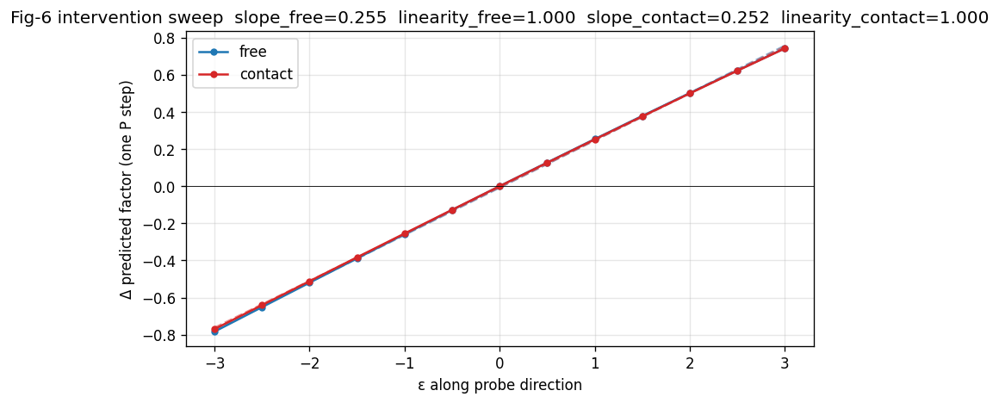

# lewm-phi visual report

Scalars are the citable result; figures navigate.

## CA0 fork

**CA0-INFIDELITY** — m=1 not near-perfect (toward=0.840, d_end=1.426) — single-step prediction fails the guard.

```json
{
  "1": {
    "m": 1,
    "mean_d_end": 1.4256690740585327,
    "mean_d_start": 2.6107232570648193,
    "frac_toward": 0.84,
    "n": 50
  },
  "3": {
    "m": 3,
    "mean_d_end": 2.0167295932769775,
    "mean_d_start": 2.6107232570648193,
    "frac_toward": 0.66,
    "n": 50
  },
  "5": {
    "m": 5,
    "mean_d_end": 2.351325273513794,
    "mean_d_start": 2.6107232570648193,
    "frac_toward": 0.62,
    "n": 50
  },
  "12": {
    "m": 12,
    "mean_d_end": 5.036725044250488,
    "mean_d_start": 2.6107232570648193,
    "frac_toward": 0.08,
    "n": 50
  },
  "25": {
    "m": 25,
    "mean_d_end": 8.228082656860352,
    "mean_d_start": 2.6107232570648193,
    "frac_toward": 0.02,
    "n": 50
  }
}
```

## C0 oracle-imagine (open-loop)

toward-goal **0.02** mean ‖ẑ_end−z*‖ **8.228082070350647** (n=50)

## CEM on live-bank

success_rate **50.0**  n=50

## B1 probes

mean linear R² **0.7019352061407906**  D6 **keep_extract**

## B2 drift

predicted-only **9.833385483078334**  at h=5 **5.260403156280518**

## CA1 contact vs free

```json
{
  "rows": [
    {
      "source": "dump",
      "env": "pusht",
      "n_segments": 48,
      "segment_len": 26,
      "contact": {
        "n_steps": 37,
        "mean_drift": 11.503300003103307,
        "median_drift": 11.654685974121094
      },
      "wall": {
        "n_steps": 0,
        "mean_drift": null,
        "median_drift": null
      },
      "any_event": {
        "n_steps": 37,
        "mean_drift": 11.503300003103307,
        "median_drift": 11.654685974121094
      },
      "free": {
        "n_steps": 1067,
        "mean_drift": 9.77547827533393,
        "median_drift": 9.438911437988281
      },
      "ratio_contact_over_free": 1.1767506079092949,
      "dump": "eval_results/pusht/phase_b_dump/seed0/dump.npz"
    },
    {
      "source": "dump",
      "env": "pusht",
      "n_segments": 48,
      "segment_len": 26,
      "contact": {
        "n_steps": 5,
        "mean_drift": 4.371025967597961,
        "median_drift": 4.3930888175964355
      },
      "wall": {
        "n_steps": 0,
        "mean_drift": null,
        "median_drift": null
      },
      "any_event": {
        "n_steps": 5,
        "mean_drift": 4.371025967597961,
        "median_drift": 4.3930888175964355
      },
      "free": {
        "n_steps": 1099,
        "mean_drift": 5.2641671854761976,
        "median_drift": 4.817766189575195
      },
      "ratio_contact_over_free": 0.8303357043175971,
      "dump": "eval_results/pusht/phase_b_dump_diverse/seed0/dump.npz"
    },
    {
      "source": "ca0",
      "env": "pusht",
      "m_open_loop": 25,
      "n_pairs": 50,
      "contact": {
        "n_steps": 104,
        "mean_drift": 6.63660192489624,
        "median_drift": 5.2034759521484375
      },
      "wall": {
        "n_steps": 69,
        "mean_drift": 7.29213809967041,
        "median_drift": 6.25421142578125
      },
      "any_event": {
        "n_steps": 150,
        "mean_drift": 6.2192277908325195,
        "median_drift": 5.632632255554199
      },
      "free": {
        "n_steps": 1000,
        "mean_drift": 4.981940269470215,
        "median_drift": 4.167542457580566
      },
      "ratio_contact_over_free": 1.3321319738749064,
      "note": "Uses CA0 m=25 (or largest m) \u1e91 vs encoded true path."
    }
  ],
  "note": "Scalars only. Fig-3 in viz.py draws the curve. ratio_contact_over_free >> 1 suggests a contact-representation fault."
}
```

## CA3 sweep

factor `block_x`

## Figures

### oracle_overlay

Motivates: ‖ẑ_end−z*‖ and toward-goal fraction vs m (CA0 curve)

```json
{
  "d_end_open": 18.841596603393555,
  "d_end_closed": 2.5733795166015625,
  "d_start": 2.6254725456237793,
  "toward_open": false,
  "toward_closed": true,
  "fork": "CA0-INFIDELITY",
  "pair": 0
}
```



### cem_landscape

Motivates: cost(oracle actions) − cost(CEM-selected) (planner regret)

```json
{
  "selected_cost": 5.688507556915283,
  "oracle_cost": 21.755271911621094,
  "regret": 16.06676435470581,
  "n_candidates": 300
}
```



### drift_contacts

Motivates: free-space vs contact mean-drift scalars

```json
{
  "free_mean_drift": 9.77547827533393,
  "contact_mean_drift": 11.503300003103307,
  "ratio": 1.1767506079092949,
  "segment": 0
}
```



### rank_spectrum

Motivates: elbow index and dead-dim fraction (CA2)

```json
{
  "participation_ratio": 22.45205206549647,
  "elbow_90": 29,
  "dead_dim_fraction": 0.578125,
  "z_dim": 192
}
```



### probe_faithfulness

Motivates: conditional R² by region (near-wall vs center)

```json
{
  "r2_all": 0.9983716011047363,
  "r2_wall": null,
  "r2_center": 0.9983716011047363,
  "factor": "block_x"
}
```



### rollout_filmstrip

Motivates: step index where NN-retrieval distance crosses a threshold

```json
{
  "nn_cross_step": 19,
  "nn_threshold": 16.051511609653318,
  "mean_nn_dist": 9.383233987745443
}
```



### intervention_sweep

Motivates: slope + linearity (R² of the ε→movement fit) per region

```json
{
  "slope_free": 0.25487919833388306,
  "linearity_free": 0.9997807571299042,
  "slope_contact": 0.252406311067906,
  "linearity_contact": 0.9998915437057058
}
```


