# Diagnostic report (lewm-phi)

*date=2026-08-30 · git_sha=715d599 · dump_version=1 · seed=0 · ckpt=hf_pusht · ca0=eval_results/pusht/ca0_closed_loop/seed0 · dump=eval_results/pusht/phase_b_dump/seed0 · cem_capture=eval_results/pusht/cem_capture/seed0 · oracle_bank=eval_results/pusht/c0_oracle_livebank/seed0 · n_pairs=50 · fork_json=CA0-INFIDELITY*

## Bottom line

Bank-mean open-loop end-dist 8.23 exceeds start 2.61: the imagined rollout drifts. Median one-step error 1.21 (cut 0.8). Fork CA0-INFIDELITY: m=1 not near-perfect (toward=0.840, d_end=1.426) — single-step prediction fails the guard. Signed cost gap 16.1 is positive: the model scores the oracle worse than the CEM pick (model problem, not a search miss). CEM is still lowering cost; more iterations would move further from the oracle, not toward it. Next: CA-train is motivated; C1 stays gated. Do not retune the CA0 cuts.

## Scalars

| Fig | Scalar | Value | Threshold | Verdict |
|-----|--------|------:|-----------|---------|
| a1 | `d_end_open` | 8.23 | — | — |
| a1 | `d_end_closed` | 2.35 | — | — |
| a1 | `d_start` | 2.61 | — | — |
| a1 | `frac_toward_open` | 0.02 | — | — |
| a1 | `frac_toward_closed` | 0.62 | — | — |
| a1 | `frac_pairs_drift` | 0.98 | — | — |
| a1 | `example_d_end_open` | 18.8 | — | — |
| a1 | `example_d_start` | 2.63 | — | — |
| a1 | `example_toward_open` | no | — | — |
| a1 | `pca_captured_variance` | 0.819 | — | — |
| a1 | `in_plane_drift_fraction` | 0.504 | 0.35 | informative |
| a1 | `fork` | CA0-INFIDELITY | — | — |
| a1 | `n_pairs` | 50 | — | — |
| a1 | `bank` | ca0-livebank | — | — |
| a2 | `median_onestep_error` | 1.21 | 0.8 | fail |
| a2 | `median_adjacent_true_z` | 1.23 | — | — |
| a2 | `onestep_over_adjacent` | 0.983 | — | — |
| a2 | `same_state_reencode_median` | 0 | — | — |
| a2 | `accumulation_slope` | 0.289 | — | — |
| a2 | `recovery_m` | 1 | — | — |
| a2 | `fork` | CA0-INFIDELITY | — | — |
| a2 | `bank` | ca0-livebank | — | — |
| b1 | `selected_cost` | 5.69 | — | — |
| b1 | `oracle_cost` | 21.8 | — | — |
| b1 | `signed_cost_gap` | 16.1 | 0 | model |
| b1 | `n_candidates` | 300 | — | — |
| b1 | `pca_captured_variance` | 0.319 | — | — |
| b1 | `line_search_delta` | 16.1 | — | — |
| b2 | `iters_to_plateau` | 6 | — | — |
| b2 | `final_elite_gap_to_oracle` | -16.1 | — | — |
| b2 | `still_improving_at_end` | yes | — | wrong-objective |
| a3 | `free_mean_drift` | 4.98 | — | — |
| a3 | `contact_mean_drift` | 6.22 | — | — |
| a3 | `ratio_contact_over_free` | 1.25 | 1.5 | smooth |
| a3 | `block_xy_share` | 0.00433 | — | — |
| a3 | `agent_xy_share` | 0.00427 | — | — |
| a3 | `pose_probe_share_sum` | 0.00995 | — | — |
| a3 | `bank` | ca0-livebank | — | — |
| d1 | `participation_ratio` | 22.5 | — | — |
| d1 | `nonlinear_id` | 0.337 | — | — |
| d1 | `elbow_90` | 29 | — | — |
| d1 | `dead_dim_fraction` | 0.578 | 0.4 | hard-elbow |
| d1 | `z_dim` | 192 | — | — |
| a4 | `error_action_corr` | 0.012 | — | — |
| a4 | `error_in_box` | 1.41 | — | — |
| a4 | `error_at_bound` | 1.5 | — | — |
| a5 | `mean_angular_error_deg` | 42.5 | — | — |
| a5 | `mean_angular_error_deg_steps` | 42.6 | — | — |
| a5 | `example_plane_angle_deg` | 73.9 | — | — |
| a5 | `example_full_angle_deg` | 78.8 | — | — |
| a5 | `pca_captured_variance` | 0.819 | — | — |
| a5 | `n_pairs` | 50 | — | — |
| a5 | `bank` | ca0-livebank | — | — |
| b3 | `mean_step_deviation` | 5.93 | — | — |
| b3 | `first_bad_step` | — | — | — |
| c2 | `r2_all` | 0.998 | — | — |
| c2 | `r2_wall` | — | — | — |
| c2 | `r2_center` | 0.998 | — | — |
| c2 | `factor` | block_x | — | — |
| c2 | `bank` | pusht/kinematic | — | — |
| d2 | `slope_free` | 0.255 | — | — |
| d2 | `linearity_free` | 1 | — | — |
| d2 | `slope_contact` | 0.252 | — | — |
| d2 | `linearity_contact` | 1 | — | — |
| e1 | `cem_success_rate` | 0.5 | — | — |
| f1 | `nn_cross_step` | 19 | 16.1 | — |
| f1 | `nn_threshold` | 16.1 | — | — |
| f1 | `mean_nn_dist` | 9.38 | — | — |
| f1 | `frac_large_retrieval` | 0.269 | — | — |

## Q-A  Does the rollout drift?

**Verdict.** Bank-mean open-loop end-dist 8.23 exceeds start 2.61: the imagined rollout drifts.

#### A1 — Does the rollout drift, and how?

**What this is.** Bank-mean ‖ẑ_end−z*‖ is the citable scalar. Panels are one labeled example pair in a PCA fit on that pair's real z, paired with that pair's full-space distance to z*.

**How to read it.** Overshoot of z* suggests calibration; wander orthogonal from step 1 suggests action mis-representation; track-then-diverge suggests accumulation. If in-plane fraction is small, trust the right panel. Do not read the example end-dist as the bank mean.

**Reading here.** Bank mean open-loop end-dist 8.23 vs start 2.61 (98% of pairs drift). Example pair 0: 18.84 vs 2.63; in-plane 0.50 (overlay informative).

**What would overturn this.** Bank-mean open-loop ẑ staying at or below d_start would overturn the drift claim.

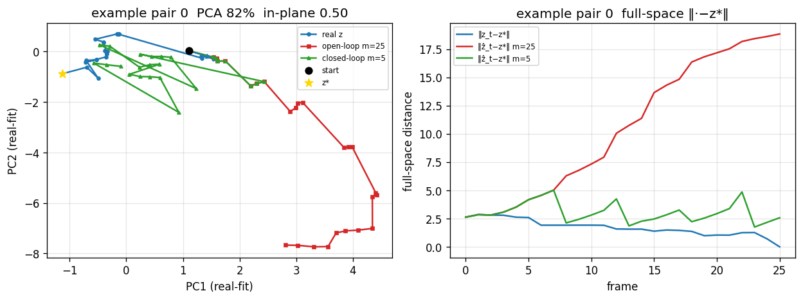

## Q-B  Accumulation or per-step infidelity?

**Verdict.** Median one-step error 1.21 (cut 0.8). Fork CA0-INFIDELITY: m=1 not near-perfect (toward=0.840, d_end=1.426) — single-step prediction fails the guard.

#### A2 — Accumulation or per-step infidelity?

**What this is.** Teacher-forced one-step errors (m=1) beside the CA0 recovery curve over re-encode interval m. Adjacent true-z is the scale of one real step (motion + two encodes), not same-frame encoder noise.

**How to read it.** Large single-step error → per-step infidelity (retrain). Tiny single-step and a steep drop as m shrinks → accumulation (protocol). Compare one-step error to adjacent true-z; same-state re-encode is the instrument floor under the m=1 guard.

**Reading here.** Median one-step 1.21 vs adjacent true-z 1.23; same-state re-encode 0.00. recovery-m=1; fork CA0-INFIDELITY.

**What would overturn this.** m=1 toward-goal ≥ 0.90 and end-dist ≤ 1.0 would pass the teacher-force guard and reopen the accumulation reading. A same-state re-encode floor near that 1.0 cut would mean the guard is below the instrument.

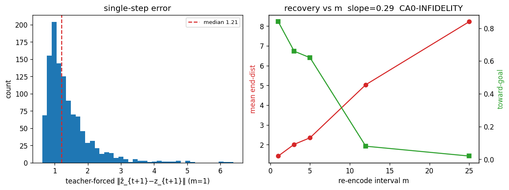

## Q-C  Search or model problem?

**Verdict.** Signed cost gap 16.1 is positive: the model scores the oracle worse than the CEM pick (model problem, not a search miss). CEM is still lowering cost; more iterations would move further from the oracle, not toward it.

#### B1 — Search problem or model problem?

**What this is.** Final CEM candidate set: cost vs distance, interpolation toward the oracle, PCA of actions.

**How to read it.** Bowl vs flat plate vs rugged in B1a. Line-search down toward the oracle = search failed to find; up = the model scores the good action worse.

**Reading here.** signed gap 16.07 (model)

**What would overturn this.** A negative signed gap with line-search decreasing toward the oracle would read as search, not model.

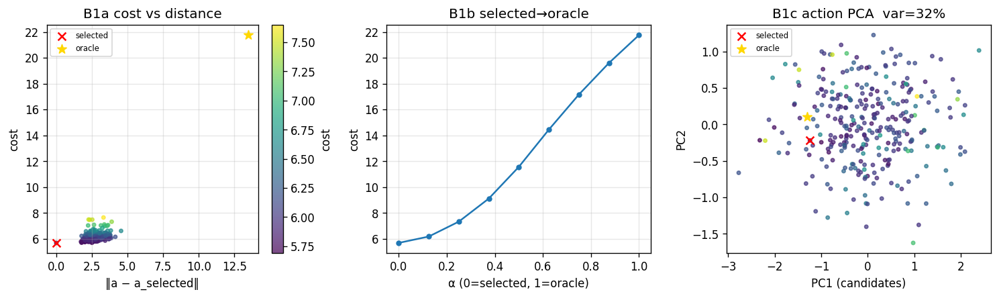

#### B2 — Did CEM give up, or converge confidently to a bad optimum?

**What this is.** Elite best/mean CEM cost across iterations (not the full candidate tensor).

**How to read it.** If the oracle costs *more* than the CEM pick, further iterations descend a mis-ranked objective and move *away* from the good action — that is not an under-budget search problem. Under-budget only applies when the oracle is cheaper than the elite and the curve is still falling.

**Reading here.** plateau ~6; still improving=True (wrong-objective); elite−oracle=-16.07.

**What would overturn this.** A late drop that *reaches* oracle cost would read as under-budget search, not a model-scoring fault.

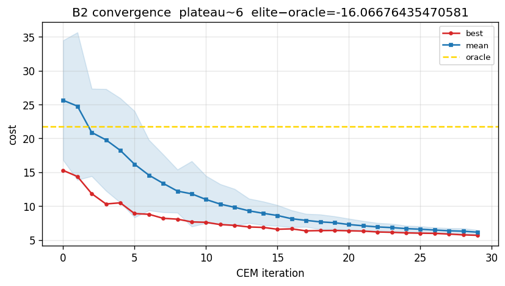

## Q-D  Why / where does it drift?

**Verdict.** Contact/free drift ratio 1.25 — not a contact spike. Linear pose-probe directions explain 0.00995 of drift energy (not a block-vs-agent split). A3 bank: ca0-livebank. Bank-mean full-space action-effect angle 42.5°.

#### A3 — Why does it drift — contact vs steady, in which factor?

**What this is.** Per-step prediction error with contact/wall bands, plus mean per-step energy along linear pose-probe directions. Bank: ca0-livebank. Example segment 0 in the left panel; contact/free scalars are over the whole dump.

**How to read it.** Jumps at red bands → contact-representation fault. Pose-probe shares near zero → drift lives outside the linear pose subspace (not 'lost the block' vs 'lost the agent').

**Reading here.** contact/free ratio 1.25; block_xy 0.004; agent_xy 0.004; pose-probe sum 0.010.

**What would overturn this.** A ratio ≫ 1.5, or pose-probe shares dominating ‖Δz‖², would overturn a 'generic / off-pose-subspace' reading.

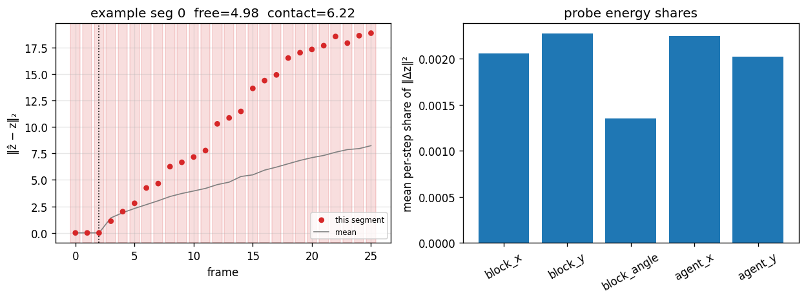

#### A5 — Does the model get action direction right?

**What this is.** Left: example-pair quiver in a real-fitted PCA plane (lossy). Right: per-pair mean angle in full z — the citable scalar.

**How to read it.** Aligned arrows → direction is right even if speed is wrong. Trust the histogram, not the 2D shadow. A ~40° full-space error is a systematically wrong action→next-state map, not isotropic jitter.

**Reading here.** Bank-mean full-space angle 42.49° (steps 42.57°). Example pair 0: plane 73.87° vs full 78.83°.

**What would overturn this.** Bank-mean full-space angle near 0° would say the model gets action direction right.

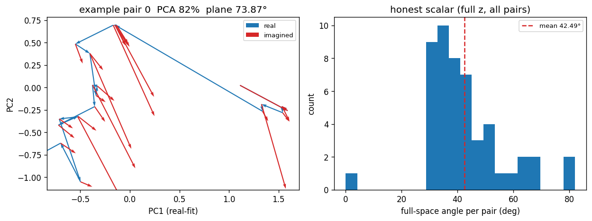

## Q-E  Objective and representation?

**Verdict.** Participation ratio 22.5, nonlinear ID 0.337, dead-dim 0.578 — hard elbow, do not scale.

#### D1 — Is capacity/structure the issue (should we scale)?

**What this is.** Linear spectrum of z plus a TwoNN intrinsic-dimension estimate. Linear scree cannot see a curved manifold.

**How to read it.** Sharp elbow, dead tail, and low nonlinear ID → genuine low-rank; do not scale the token.

**Reading here.** PR=22.5, nonlinear ID=0.3, dead=0.58.

**What would overturn this.** Nonlinear ID near the ambient 192 with a soft tail would reopen 'entanglement / unused capacity'.

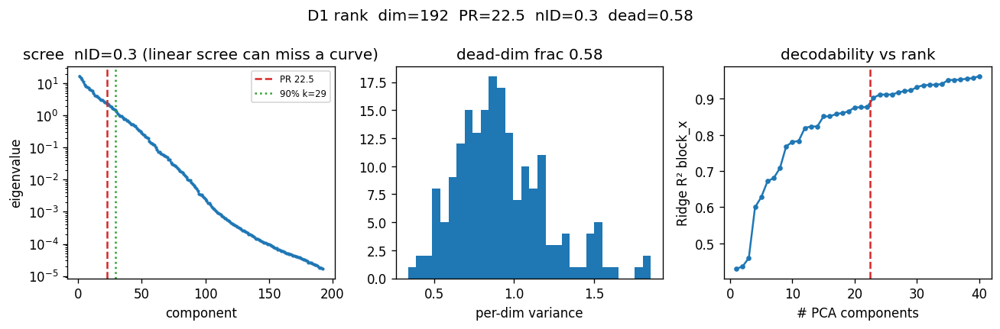

## Appendix (Tier 3)

#### A4 — Is fidelity uniform, or regime-limited by action size?

**What this is.** Teacher-forced one-step error against action magnitude on oracle paths.

**How to read it.** A rising cloud at large |a| means the model is worse at the action boundary.

**Reading here.** corr=0.01; in-box 1.41 vs bound 1.50.

**What would overturn this.** Near-zero correlation with equal in-box and bound error would say fidelity is not action-regime limited.

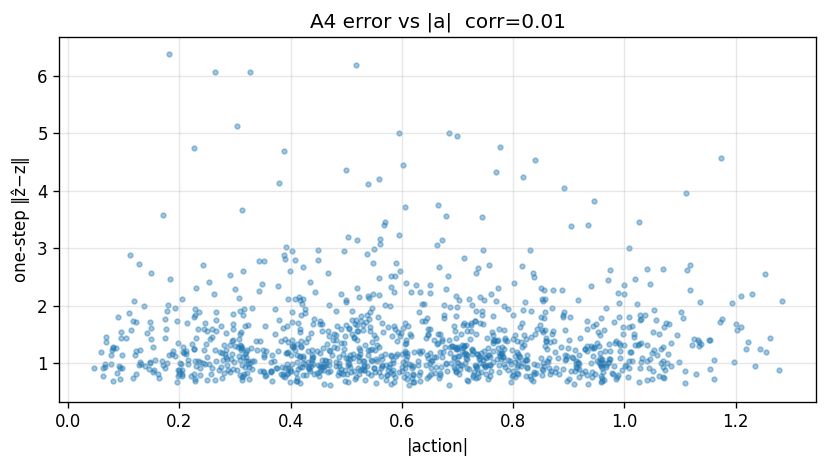

#### C2 — Where does block-pose legibility fail physically?

**What this is.** Linear probe of a pose factor vs truth, with residual heat on the board.

**How to read it.** Wall vs center R² split shows whether legibility is spatially uniform.

**Reading here.** R² all=1.00 wall=no wall-band samples in this bank center=1.00. In-sample fit on pusht/kinematic — not the episode-holdout probe.

**What would overturn this.** A large wall/center R² gap would mean legibility (and likely planning) fails in a physical region.

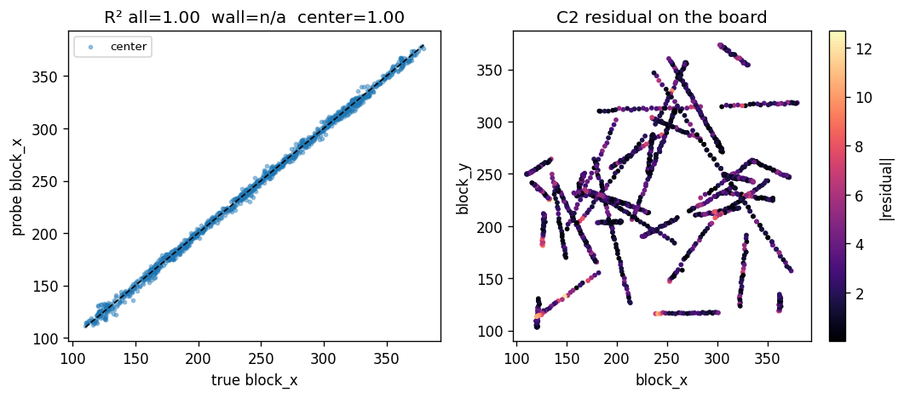

#### D2 — Is legible geometry cleanly actionable in one P step?

**What this is.** Predicted factor movement vs intervention size, free vs contact. One P step only — not the full D2 persistence/combine suite.

**How to read it.** Linear monotone → usable for latent steering. Kink or contact-only saturation → bounded usable region.

**Reading here.** slope_free=0.255 linearity_free=1.000 slope_contact=0.252 linearity_contact=1.000

**What would overturn this.** A contact-only kink or near-zero slope would bound latent-space steering, especially near contact.

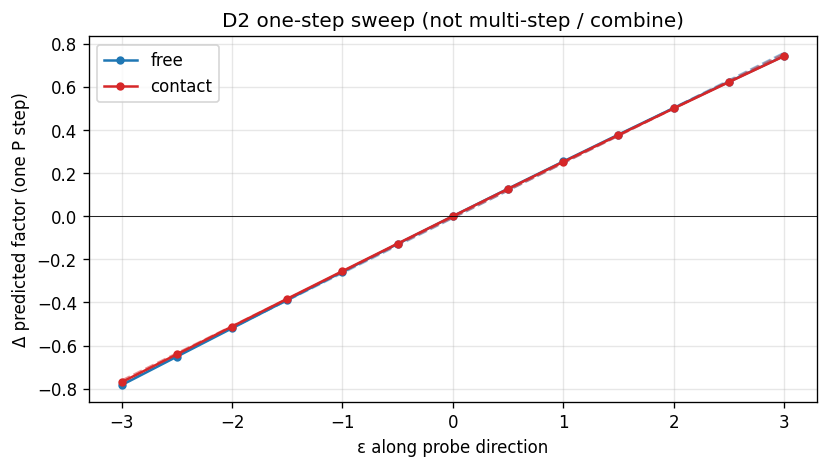

#### E1 — Do failures cluster by goal pose?

**What this is.** Target block poses colored by CEM success on the live-bank pairs.

**How to read it.** Spatial clusters of failure that overlap high-residual (C2) or high-drift (A3) regions are one hard-region story.

**Reading here.** CEM success 0.5.

**What would overturn this.** Spatially uniform success would say failures are not a pose-region phenomenon.

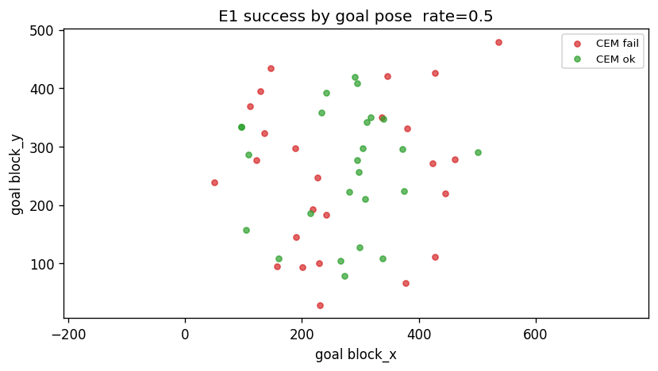

#### F1 — Where physically does imagination diverge? (qualitative)

**What this is.** True frames beside the nearest real encoded frame to ẑ_t. Qualitative / exploratory — not a decoder.

**How to read it.** A large NN distance means the model is imagining a state unlike any real frame in this episode.

**Reading here.** first large retrieval at t=19 (thresh=16.05).

**What would overturn this.** NN distances staying small through the horizon would mean imagined latents remain on the real episode manifold.

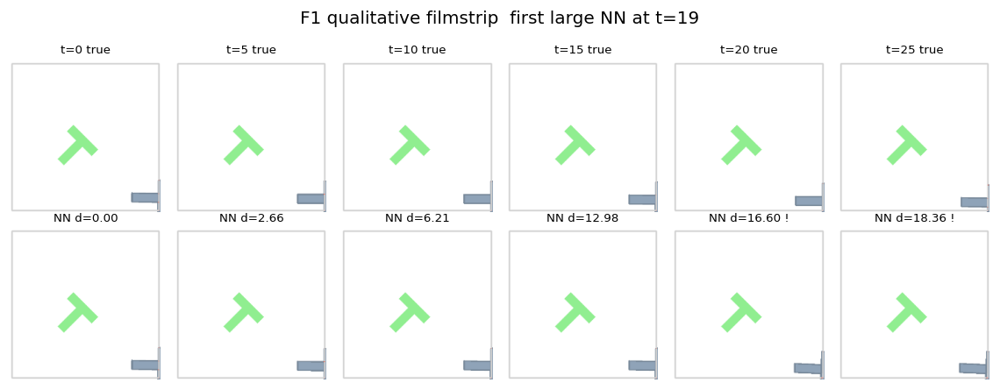

#### B3 — Which action in the chunk is wrong?

**What this is.** Horizon-step deviation between CEM-selected tokens and packed oracle tokens.

**How to read it.** First-right/later-wrong → receding-horizon is fine, lookahead is the problem. Uniformly large deviation → the whole chunk is off-oracle.

**Reading here.** no single first-bad step; mean 5.93 — whole plan off-oracle (not a late-lookahead miss).

**What would overturn this.** Uniformly small per-step deviation would mean CEM found a near-oracle plan in action space.

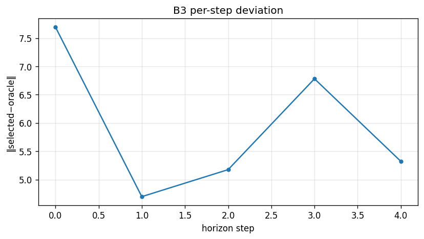

